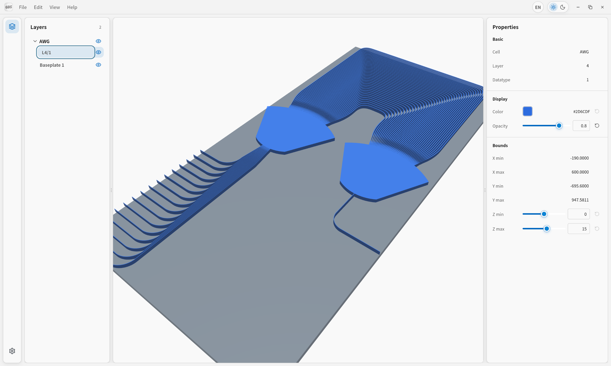

# gds3d

A desktop 3D visualization and editing tool for GDSII layouts.

gds3d imports GDS files, lets you inspect layout layers in an interactive 3D viewport, and saves the resulting workspace as a project file. It is built with [Tauri 2](https://v2.tauri.app/), [Svelte](https://svelte.dev/), [Babylon.js](https://www.babylonjs.com/), and Rust.



## Develop

Install the following prerequisites:

- [Rust](https://www.rust-lang.org/tools/install)
- Node.js 24 or later
- [pnpm](https://pnpm.io/)
- [only](https://github.com/KercyDing/only)

Start the desktop application with:

```bash
only dev
```

Run the full local verification suite with:

```bash
only ci
```

Build a distributable application with:

```bash
only build
```

## License

[MIT](LICENSE)
